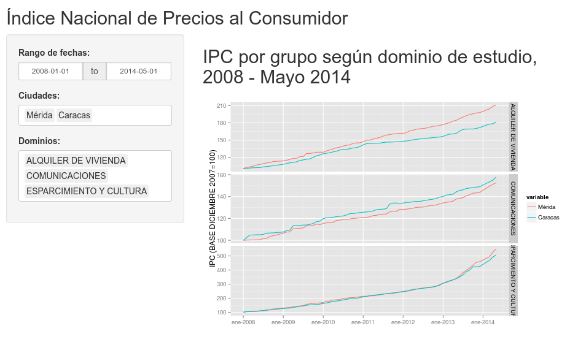

Venezuelan Consumer Price Index Reproducible Plots
========================================================
author: Francisco Palm (map0logo)
date: 22/02/2015

Data
========================================================

- Data is taken from Venezuelan Statistics National Institute (INE)

- From "Indice de Precios al Consumidor" (Consumer Price Index, CPI) page: 

http://www.ine.gob.ve/index.php?option=com_content&view=category&id=108&Itemid=62

- Select "INPC POR CIUDADES" (National CPI per city)

- and then "Por grupo según dominio de estudio, 2008 - Mayo 2014" (By group according to study domain, 2008 - May 2014).

http://www.ine.gob.ve/documentos/Economia/IndicedePreciosalconsumidor/xls/PorCiudades/4_6_3.xls

Data Processing
========================================================

- Data is a Microsoft Excel File with 75 sheets, each one containing IPC data
in 10 largest Venezuela cities for 13 "domains" (food, alcoholic beverages,
clothing, rental housing, ...) from jan 2008 to may 2014.

- Loading data it is quite tricky because this spreadsheet is edited by hand, so
there are little and annoying differences on data format. See `read_data.R` in https://github.com/map0logo/devdataprod-011 repo.


```r
load("data.Rdata")
```

- We get a resulting data frame `data` with:1050 observations and
14 variables.

Interface Design
========================================================

The interface has a `sidebarPanel`:

- a `dateRangeInput` for dates
- a `selectInput` for cities, and
- another `selectInput` for Domains

And a `mainPanel` which generates an automatic plot of CPI time series along
selected date range for selected Cities faceted by domains.

This plot is generated using `ggplot2`

Application Output
========================================================

Here we have an screenshot of this app:



Advantages
========================================================

- This application is published in https://mapologo.shinyapps.io/dp_mapologo

- Is a small demonstration to show the power and flexibility to generate data
directly from the data. Reproducible Public Data.

- Instead of offering cumbersome and impractical Excel files, Shiny applications
allow to display information in an attractive and dynamic format, much more
useful to gain understanding and consequently more suitable for analysis and
informed decision making.

